# TALLER OBJETOS  # EJERCICIOS # JAVASCRIPT

## AUTOR 
- Daniel Andres Gonzalez Betancourt

## Ejercicio #1

 Crear un metodo constructor llamada persona. Sus atributos son: nombre, edad y cedula. Construye los siguientes métodos para la clase:
// 1.1 mostrar(): Muestra los datos de la persona. 1.2 es_mayor_de_edad(): Devuelve un valor lógico indicando si es mayor de edad.

```javascript
class Persona{
    constructor(nombre, edad, cedula){
        this.nombre = nombre;
        this.edad = edad;
        this.cedula = cedula;
    }
mostrar() {
   return console.log('nombre:' + this.nombre + ' cedula: '+ this.cedula + ' edad: '+ this.edad);
}

mayorEdad(){
    if(this.edad >= 18) {console.log('Es mayor de edad')}
    else{console.log('No es mayor de edad')}
}

}

let persona1= new Persona('daniel',28,'1053827199');
persona1.mostrar();
persona1.mayorEdad();

```
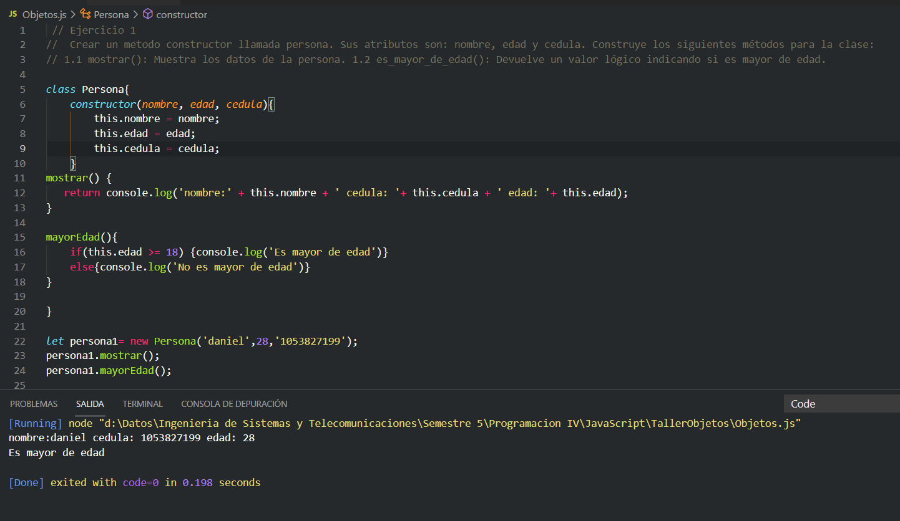


## Ejercicio #2
 2. Crea un metodo constructor llamado cuenta que tendrá los siguientes atributos: titular (que es nombre de la persona) y cantidad.
El titular será obligatorio y la cantidad es opcional. Construye los siguientes métodos para el metodo:
 2.1 mostrar(): Muestra los datos de la cuenta. 2.2 ingresar(cantidad): se ingresa una cantidad a la cuenta, 
si la cantidad introducida es negativa, no se hará nada. 2.3 retirar(cantidad): se retira una cantidad a la cuenta. La cuenta puede estar 
en números rojos.

```javascript
function Cuenta(titular, cantidad){
    this.titular = titular;
    this.cantidad = cantidad;

    if(this.cantidad == undefined){ this.cantidad = 0};
    this.mostrar = function(){return console.log(' Nombre del titular: ' + this.titular + " Cantidad : " + this.cantidad); }

    this.ingresarCantidad = function(cantidadCuenta){ if (cantidadCuenta >=0) {this.cantidad = cantidadCuenta} }
    
    this.retirarCantidad = function(retiro){ if (retiro >=0) {this.cantidad = this.cantidad - retiro} }
}

let cuenta1 = new Cuenta("Andres Gonzalez");
cuenta1.mostrar();
cuenta1.ingresarCantidad(2500);
cuenta1.mostrar();
cuenta1.retirarCantidad(200);
cuenta1.mostrar();


```
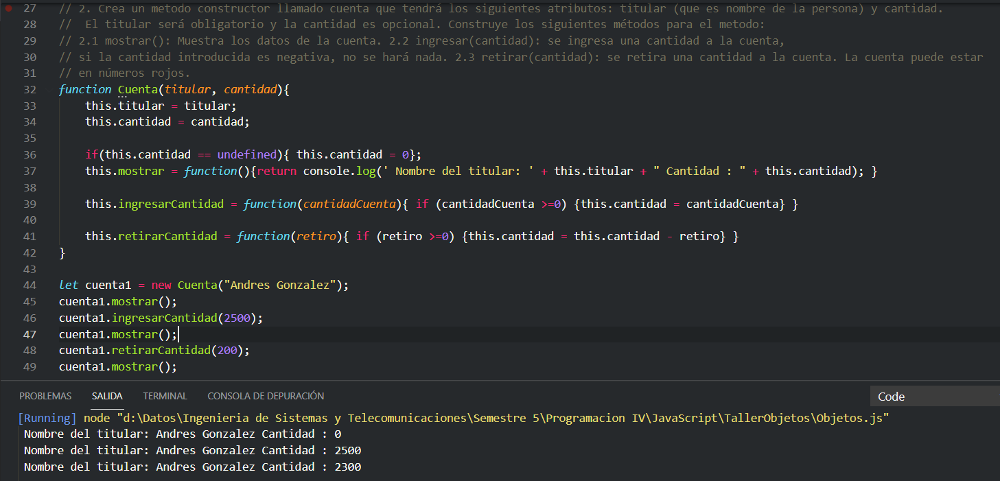

## Ejercicio #3
 Crear un metodo constructor llamado formulas. Construye los siguiente metodos para la clase:
3.1 sumar(entero, entero) 3.2 fibonacci(cantidad) a partir de una entero sacar los numeros 
3.3 operacion_modulo(cantidad) a partir de una cantidad mostrar cuales dan residuo 0 
 3.4 primos(cantidad) a partir de una cantidad mostrar cuales 

```javascript
function formulas(){

this.sumar = function(entero1, entero2){ return console.log('la suma es: '+ (entero1 + entero2)); }

this.serieFibonaci = function(cantidad){
    console.log('La serie fibonacci es:');
	this.fibo = [0,1];
	for(i=2; i <= cantidad; i++){
		this.fibo.push(this.fibo[i-1] + this.fibo[i-2]);
		console.log(this.fibo[i]);
	}    
}

this.operacionModulo = function(cantidad){
    this.cantidad = cantidad;
    let divisor = cantidad;
    console.log('Los dividores del numero indicado son:')
    while(divisor != 0){
        if(this.cantidad % divisor == 0) {
            console.log(divisor);
            divisor--;
        }else{divisor--;}
    }    
}

this.primos = function(cantidad){

this.cantidad = cantidad;
let divisor = cantidad;
let cont = 0;
while(divisor != 0){
    if(this.cantidad % divisor == 0) {
        cont++;
        divisor--;
    }else{divisor--;}
}  

if(cont == 2){console.log('El numero es Primo');}
else{console.log('El numero NO es primo');}

}

}

let form = new formulas;
form.sumar(3,7)
form.serieFibonaci(12);
form.operacionModulo(203045);
form.primos(19);


```
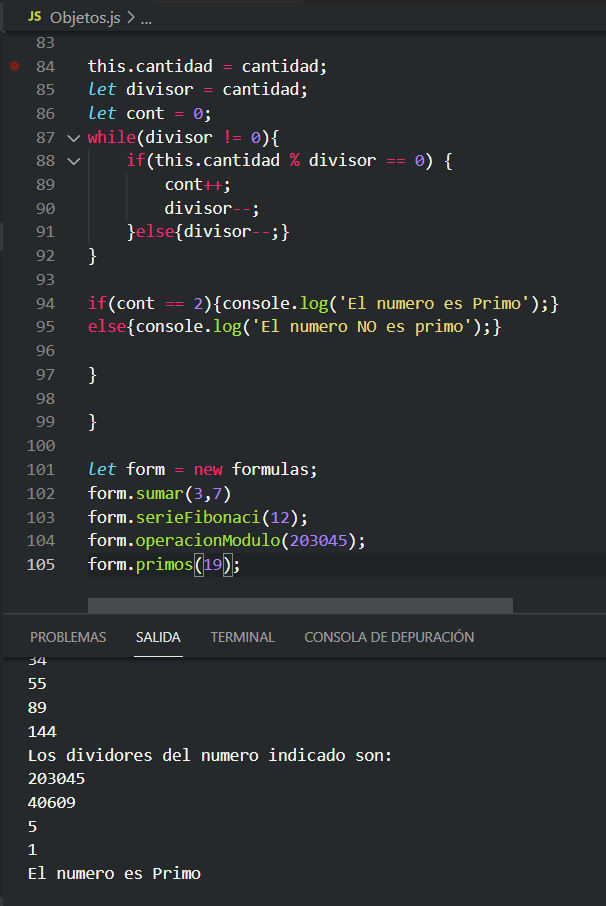

## Ejercicio #4
/Crear un metodo constructor llamado persona. Sus atributos son: nombre, edad, DNI, 
sexo (H hombre, M mujer), peso y altura Construye los siguiente metodos para la clase:
4.1 calcularIMC(): calculara si la persona esta en su peso ideal (peso en kg/(altura^2 en m)), 
si esta fórmula devuelve un valor menor que 20, la función devuelve un -1, si devuelve un número 
entre 20 y 25 (incluidos), significa que esta por debajo de su peso ideal la función devuelve un 0 y 
si devuelve un valor mayor que 25 significa que tiene sobrepeso, la función devuelve un 1. 
Te recomiendo que uses constantes para devolver estos valores. 
4.2 esMayorDeEdad(): indica si es mayor de edad, devuelve un booleano.
4.3 comprobarSexo(char sexo): comprueba que el sexo introducido es correcto. 
Si no es correcto, sera H.

```javascript
class Persona{

    constructor(nombre, edad, dni, sexo, peso, altura){
        this.nombre = nombre;
        this.edad = edad;
        this.dni = dni;
        this.sexo = sexo;
        this.peso = peso;
        this.altura = altura;
    }

    calcularIMC(){
      let calcPeso =  (this.peso/(this.altura^2));
      if(calcPeso < 20) return -1;
      else if(calcPeso >= 20 && calcPeso <= 25) return 0;
      else if (calcPeso > 25) return 1;
    }

    esMayorDeEdad(){
        if(this.edad >= 18) return true;
        else{return false};
    }

    comprobarSexo(sex){
        this.sexo = sex;
        if(this.sexo == "Masculino" || this.sexo == "Femenino" || this.sexo == "M" || this.sexo == "F" ) {
        return console.log("El sexo es correcto : " + this.sexo)
        }
        else{console.log("Sexo incorrecto, por defecto será" + " H")}

    }
}

//-------------------------LLamada a los metodos--------------------------------------------

let persona1 = new Persona("daniel", 28, 1053827199, "Masculino", 72, 1.72);

switch(persona1.calcularIMC()){
    case -1: console.log("Esta por debajo de su peso ideal");
            break;
    case 0: console.log("Esta en su peso ideal");
            break;
    case 1: console.log("Sufre de sobrepeso");
            break;
    default: console.log("Valor errado")
            break;
}

let per = function(){
    if(persona1.esMayorDeEdad) {return console.log("Es mayor de edad");}
    else{ return console.log("No es mayor de edad");}

}
per();

persona1.comprobarSexo('M');


```
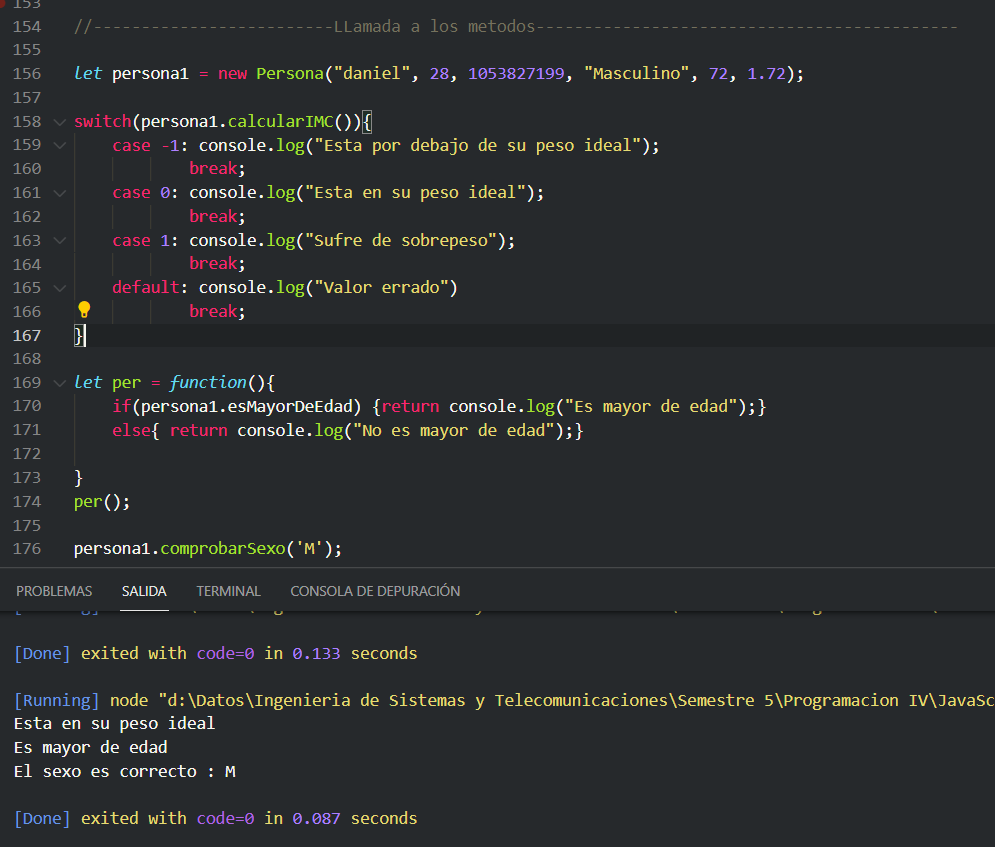

## Ejercicio #5
Crear un metodo constructor llamado contraseña. Sus atributos longitud y contraseña Construye 
los siguiente metodos para la clase:
5.1 esFuerte(): devuelve un booleano si es fuerte o no, para que sea fuerte debe tener mas de 2 mayúsculas, 
mas de 1 minúscula y mas de 5 números.
5.2 generarPassword(): genera la contraseña del objeto con la longitud que tenga. 
5.3 seguridadPaswword(); indicar si la contraseña es debil contiene entre 1 a 6 caracteres (caracteres numeros y letras), 
media (7 a 10 caracteres numeros y letras) o fuerte (11 a 20 caracteres letras y caracteres especiales)


```javascript
 function contrasenia(longitud, contrasenia){

this.longitud = longitud;
this.contrasenia = contrasenia;

    this.esFuerte = function(){

        contNumerico = 0;
        contMayuscula = 0;
        contMinusculas = 0;

        for(i=0; i <= this.contrasenia.length - 1; i++){
                    
            if (!isNaN(this.contrasenia[i])){       //Valida si el caracter en la poscion i es numerico
                contNumerico++;
            }else if(this.contrasenia[i] == this.contrasenia[i].toUpperCase()) { //Valida si el caracter es mayuscula
                contMayuscula++;
            }else if(this.contrasenia[i] == this.contrasenia[i].toLowerCase()) {  //Valida si el caracter es miniscula
                contMinusculas++;
            }
        }
        if(contNumerico >= 6 && contMayuscula >=2 && contMinusculas >= 1){
            //console.log('Contrasenia fuerte');
            return true;
        }
        else{
            //console.log('Contrasenia Debil');
            return false;
        }
    }

    this.generarPassword = function(){
        if(this.longitud >= 9){
            const cadena ='!"#$%&()*+,-./0123456789:;=?@ABCDEFGHIJKLMNOPQRSTUVWXYZ[]^abcdefghijklmnopqrstuvwxz{|}~';
            let password= ' ';
            for ( let i = 0; i < this.longitud; i++ ) {
                password += cadena.charAt(Math.floor(Math.random() * cadena.length));
            }    
            this.contrasenia = password;
            if(this.esFuerte()){
                return console.log('El password generado es : ' + password);
            }else{
                this.generarPassword();
            }
        }else{console.log('La longitud de la contrasenia no es valida, debe tener una longitud minima de 9 caracteres')}
    }

   this.seguridadPasword = function(contrasenia){
        
        this.contrasenia = contrasenia; 
        contNumerico = 0;
        contMayuscula = 0;
        contMinusculas = 0;
        contCaracterEspecial = 0;
        contCaracteres = 0;
        caracteresEspeciales = '!" #$%&()*+,-./:;=?@[]^{|}~';
        

        for(i=0; i <= this.contrasenia.length - 1; i++){
                    
            if (!isNaN(this.contrasenia[i])){       //Valida si el caracter en la poscion i es numerico
                contNumerico++;
            }else if(this.contrasenia[i] == this.contrasenia[i].toUpperCase()) { //Valida si el caracter es mayuscula
                contMayuscula++;
            }else if(this.contrasenia[i] == this.contrasenia[i].toLowerCase()) {  //Valida si el caracter es miniscula
                contMinusculas++;
            }

            for(j=0; j <= caracteresEspeciales.length - 1; j++){
                    if(this.contrasenia[i] == caracteresEspeciales[j]){
                        contCaracterEspecial++;
                    }
            }
        }

        contCaracteres = contNumerico + contMayuscula + contMinusculas + contCaracterEspecial;
      
        if(contCaracteres <= 6){console.log('Contrasenia Debil');}
        else if((contCaracteres) > 6 && (contCaracteres) <= 10){console.log('Contrasenia Media');}
        else if((contCaracteres) > 10 && (contCaracteres) <= 20){console.log('Contrasenia Fuerte');}
    }
}
//llamada a los metodos -------------------------------------------------------------------------------------------------------------

let clave = new contrasenia(9,'Xh9hSZ6j');  //Creacion del objeto

if(clave.esFuerte()){console.log('Contrasenia Fuerte');} //Validacion de la contrasenia
else{console.log('Contrasenia Debil');}

let clave2 = new contrasenia(15,'');
clave2.generarPassword();  //Solo genera un passwors fuerte y mayor a 9 caracteres para que cumpla 

clave2.seguridadPasword('cononetsfsfewgwggwoe'); //verifica la seguridad del pasword que se le ingrese


```
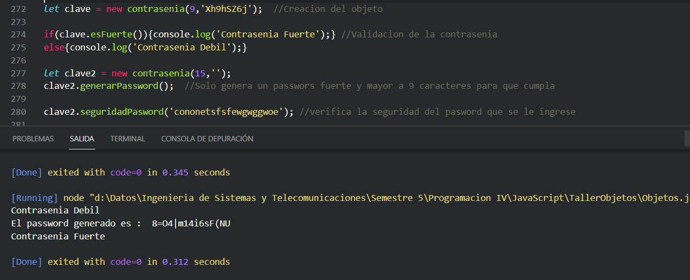

## Ejercicio #6
6. Implementar un objeto que modele un contador. Un contador se puede incrementar o decrementar, recordando el valor actual. 
Al resetear un contador, se pone en cero. Además es posible indicar directamente cual es el valor actual. 
Este objeto debe entender los siguientes mensajes: 
6.1 reset() 
6.2 inc() 
 6.3 dec() 
6.4 valorActual() 
6.5 valorActual(nuevoValor) P.ej. si se evalúa la siguiente secuencia contador.valorActual(10) contador.inc() contador.inc() 
contador.dec() contador.inc() contador.valorActual() el resultado debe ser 12.


```javascript
let contador = {
    contador : 0,
    reset : function(){this.contador = 0;},
    inc : function(){this.contador++;},
    dec : function(){this.contador--;},   
    cambiarValorActual : function(nuevoValor){this.contador = nuevoValor;},
    mostrarValorActual : function(){console.log("El valor actual del contador es : " + this.contador)}
 }

contador.cambiarValorActual(11);
contador.inc();
contador.inc(); 
contador.dec();
contador.inc();
contador.mostrarValorActual();


```
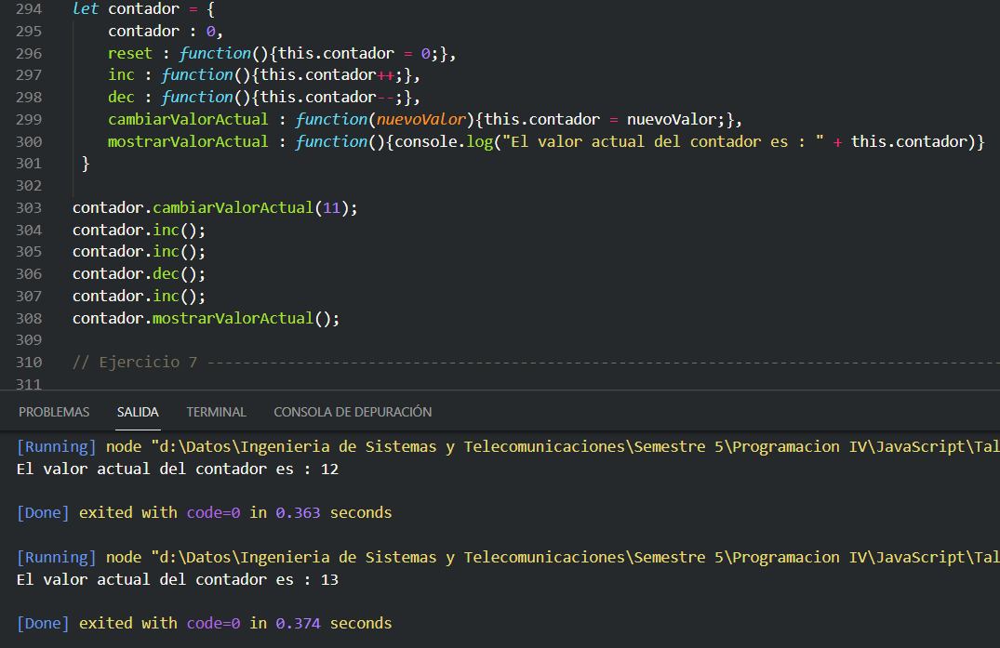

## Ejercicio #7
 Agregar al contador del ejercicio 6, la capacidad de recordar un String que representa el último comando que se le dio. 
Los Strings posibles son "reset", "incremento", "decremento" o "actualizacion" (para el caso de que se invoque valorActual con un parámetro). 
Para saber el último comando, se le envía al contador el mensaje ultimoComando().
En el ejemplo del ejercicio 3, si luego de la secuencia indicada se evalúa contador.ultimoComando() el resultado debe ser "incremento"


```javascript
let contador = {
    contador : 0,
    lastComando : "",
    reset : function(){
        this.contador = 0;
        this.lastComando = "reset";
    },
    inc : function(){
        this.contador++;
        this.lastComando = "incremento";
    },
    dec : function(){
        this.contador--;
        this.lastComando = "decremento";
    },
    mostrarValorActual : function(){
        console.log("El valor actual del contador es : " + this.contador);
        this.lastComando = "Mostrar Valor";
    },
    cambiarValorActual : function(nuevoValor){
        this.contador = nuevoValor;
        this.lastComando = "Valor Actualizado";
    },
    ultimoComando: function(){console.log("El ultimo comando fue : " + this.lastComando)}
 }

 //llamada a los metodos--------------------------------------------------------------------
 
contador.cambiarValorActual(10);
contador.inc();
contador.inc(); 
contador.dec();
//contador.inc();
contador.mostrarValorActual();
contador.ultimoComando();


```
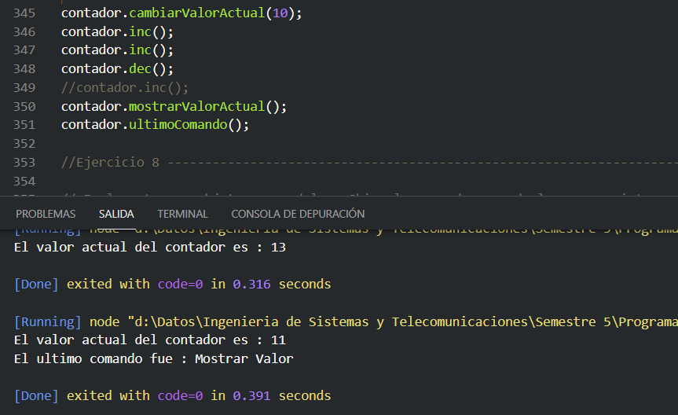

## Ejercicio #8
 Implementar un objeto que modele a Chimuela, una dragona de la que nos interesa saber qué energía tiene en cada momento,
medida en joules. En el metodo constructor simpli�cado que nos piden implementar, las únicas acciones que vamos a 
contemplar son: cuando Chimuela come una cantidad de comida especi�cada en gramos, en este caso adquiere 4 joules por cada gramo, 
y cuando Chimuela vuela una cantidad de kilómetros, en este caso gasta un joule por cada kilómetro, más 10 joules de �costo �jo� de
despegue y aterrizaje. La energía de Chimuela nace en 0. El objeto que implementa este metodo constructor de Chimuela, debe entender los 
siguientes mensajes:
 8.1 comer(gramos) 
 8.2 volar(kilometros)
 8.3 energia() P.ej. si sobre un REPL(Read-Eval-Print-Loop)(Lectura-Evaluación-Impresión) recién lanzado se evalúa la siguiente secuencia 
 Chimuela.comer(100) Chimuela.volar(10) Chimuela.volar(20) Chimuela.energia() el resultado debe ser 350.


```javascript
function Chimuela(){
    this.energia = 0;
    this.comer= function(gramos){
        this.energia +=(gramos*4);
    }
    this.volar = function(km){
        if(this.energia <= (10 + km)){
            console.log('Chimuela no tienen energia suficiente para volar, le faltan ' + (this.energia - 10) + 'Joules');
        }else{
        this.energia-=10;
        this.energia-=km;
        }
    }
    this.mostrarEnergia = function(){
        console.log(`la energia de chimuela esta en ${this.energia} Joules`)
    }
}
//LLamada a los metodos -----------------------------------------------------------------------------------------------------

let chimuela = new Chimuela();
chimuela.comer(100);
chimuela.volar(10);
chimuela.volar(20);
chimuela.mostrarEnergia(); 


```
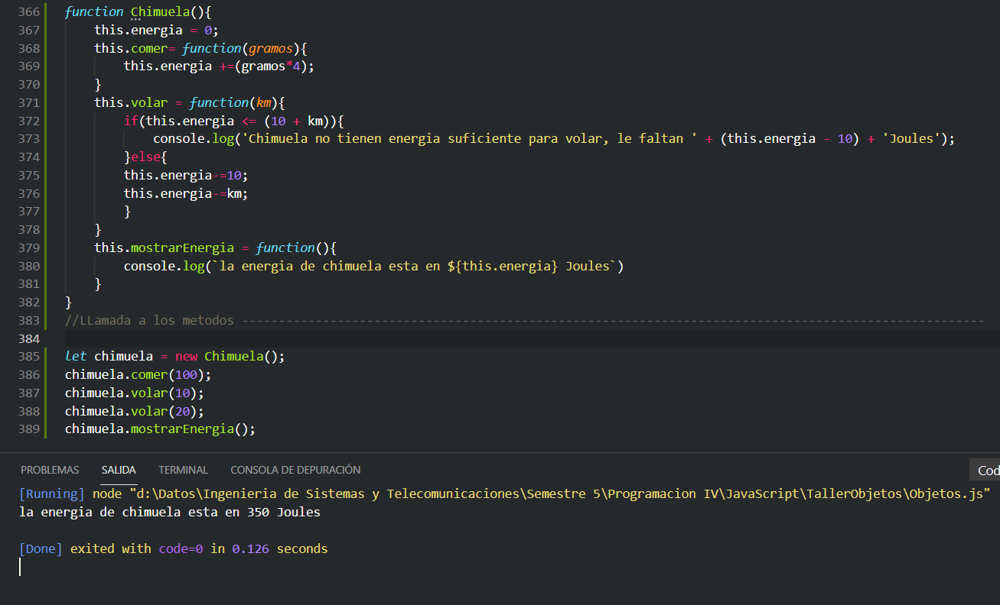

## Ejercicio #9
Agregar al metodo constructor de Chimuela del ejercicio 8,
la capacidad de entender estos mensajes: 
estaDebil(),Chimuela está débil si su energía es menos de 50. 
estaFeliz(), Chimuela está feliz si su energía está entre 500 y 1000. 
cuantoQuiereVolar(), que es el resultado de la siguiente cuenta. De base, quiere volar (energía / 5) kilómetros, 
 p.ej., si tiene 120 de energía, quiere volar 24 kilómetros. Si la energía está entre 300 y 400, 
entonces hay que sumar 10 a este valor, y si es múltiplo de 20, otros 15. Entonces, si Chimuela tiene 340 de energía, 
quiere volar 68 + 10 + 15 = 93 kilómetros. Para probar esto, sobre un REPL recién lanzado darle de comer 85 a Chimuela, 
así la energía queda en

```javascript
 function Chimuela(){
    this.energia = 0;
    this.comer= function(gramos){
        this.energia +=(gramos*4);
    }
    this.volar = function(km){
        if(this.energia <= (10 + km)){
            console.log('Chimuela no tienen energia suficiente para volar, le faltan ' + (this.energia - 10) + 'Joules');
        }else{
        this.energia-=10;
        this.energia-=km;
        }
    }
    this.mostrarEnergia = function(){
        console.log(`la energia de chimuela esta en ${this.energia} Joules`)
    }
    this.estaDebil = function(){
        if(this.energia <= 50){console.log('Chimuela esta debil');}        
    }
    this.estaFeliz = function(){
        if(this.energia >= 500 && this.energia <= 1000){console.log('Chimuela esta Feliz');}        
    }
    this.cuantoQuiereVolar = function(){       
        tiempoVuelo = 0; 
        if(this.energia >= 300 && this.energia <= 400){
            tiempoVuelo+=(this.energia/5)+10;
            if(this.energia % 20 == 0){
                tiempoVuelo+=15;
            }
        }else{
            tiempoVuelo+=this.energia/5;
        }  
        console.log(`Chimuela quiere volar ${tiempoVuelo} km`)
        this.energia-=tiempoVuelo;      
    }

}
//LLamada a los metodos -----------------------------------------------------------------------------------------------------

let chimuela = new Chimuela();
chimuela.comer(1);
chimuela.cuantoQuiereVolar();
chimuela.mostrarEnergia(); 


```
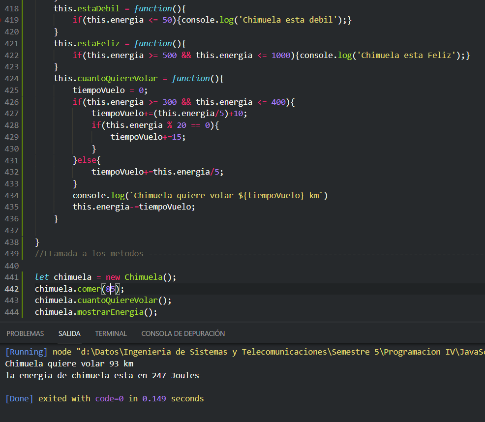

## Ejercicio #10
Implementar un objeto que represente una calculadora sencilla, que permita sumar, restar y multiplicar. 
Este objeto debe entender los siguientes mensajes: 
10.1 cargar(numero) 
10.2 sumar(numero) 
10.3 restar(numero) 
10.4 multiplicar(numero) 
10.5 valorActual() P.ej. si se evalúa la siguiente secuencia calculadora.cargar(0) calculadora.sumar(4) calculadora.multiplicar(5) 
calculadora.restar(8) calculadora.multiplicar(2) calculadora.valorActual() el resultado debe ser 24.


```javascript
function Calculadora(){

    resultado = 0;

    this.cargar = function(numero){
        resultado = numero;
    }
    this.sumar = function(numero){
        resultado+=numero;
    }
    this.restar = function(numero){
       resultado-=numero;
    }
    this.multiplicar = function(numero){
        resultado*=numero;
    }
    this.valorActual = function(){
        console.log(`El valor actual es ${resultado}`)
    }
}

//Llamada a los metodos -------------------------------------

let calc = new Calculadora();
calc.cargar(0);
calc.cargar(0);
calc.sumar(4);
calc.multiplicar(5); 
calc.restar(8);
calc.multiplicar(2);
calc.valorActual()


```
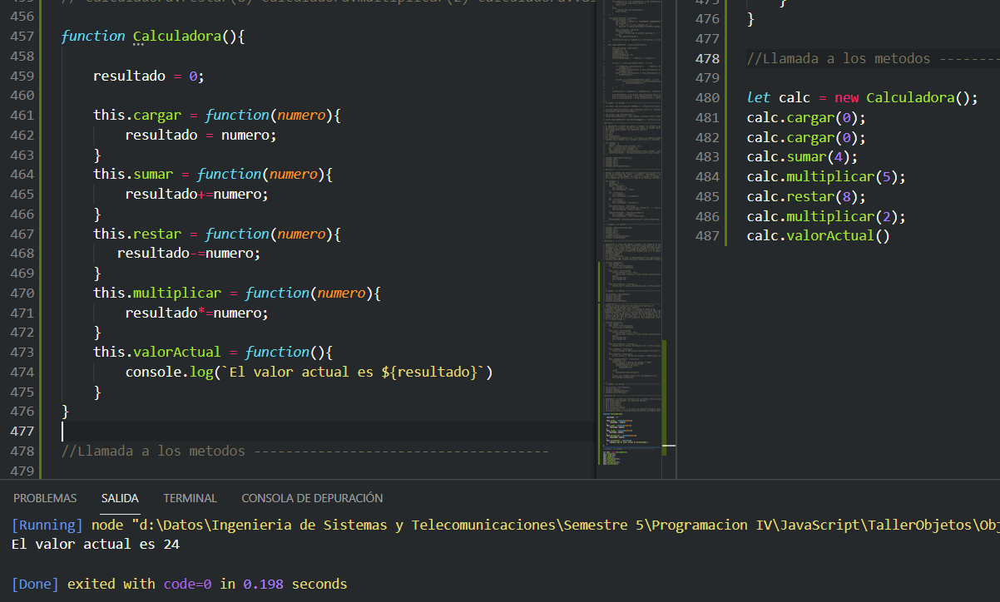

## Ejercicio #11
Crear un metodo constructor llamado Libro. Sus atributos título del libro, autor, número de ejemplares del libro y número de ejemplares prestados 
los siguiente metodos para la clase: préstamo() que incremente el atributo correspondiente cada vez que se realice un préstamo del libro. 
 No se podrán prestar libros de los que no queden ejemplares disponibles para prestar. Devuelve true si se ha podido realizar la operación y 
false en caso contrario. devolucion() que decremente el atributo correspondiente cuando se produzca la devolución de un libro.
No se podrán devolver libros que no se hayan prestado. Devuelve true si se ha podido realizar la operación y false en caso contrario. 
toString() para mostrar los datos de los libros.

```javascript
class Libro{
    constructor(titulo, autor, numeroEjemplaresL, numeroEjemplaresP){
        this.titulo = titulo;
        this.autor = autor;
        this.numeroEjemplaresL = numeroEjemplaresL;
        this.numeroEjemplaresP = numeroEjemplaresP;
    }

    libroPrestado = false;

    prestamo = function() {
        if(this.numeroEjemplaresL >= 1){
            this.numeroEjemplaresP++;
            this.numeroEjemplaresL--;
            this.libroPrestado = true;
            return true;
        }else{            
            console.log('No quedan ejemplares disponibles para prestar');
            return false;
        }

    }

     devolucion = function() {
        if(this.libroPrestado){
             this.numeroEjemplaresP--;
             this.numeroEjemplaresL++;
             this.libroPrestado = false;
             return true;
         }else{            
            console.log('El libro no ha sido prestado');
            return false;
        }
     }

     toString = function(){
         console.log(`titulo: ${this.titulo} Autor: ${this.autor} Numero de ejemplares: ${this.numeroEjemplaresL} 
         Numero de ejemplares prestados: ${this.numeroEjemplaresP}`);
     }
}
//Llamada a los metodos--------------------------------------
let libro = new Libro('Cien anios de Soledad', 'Gabriel Garcia Marquez', 20, 8);
libro.prestamo();
libro.prestamo();
libro.devolucion();
libro.toString();


```
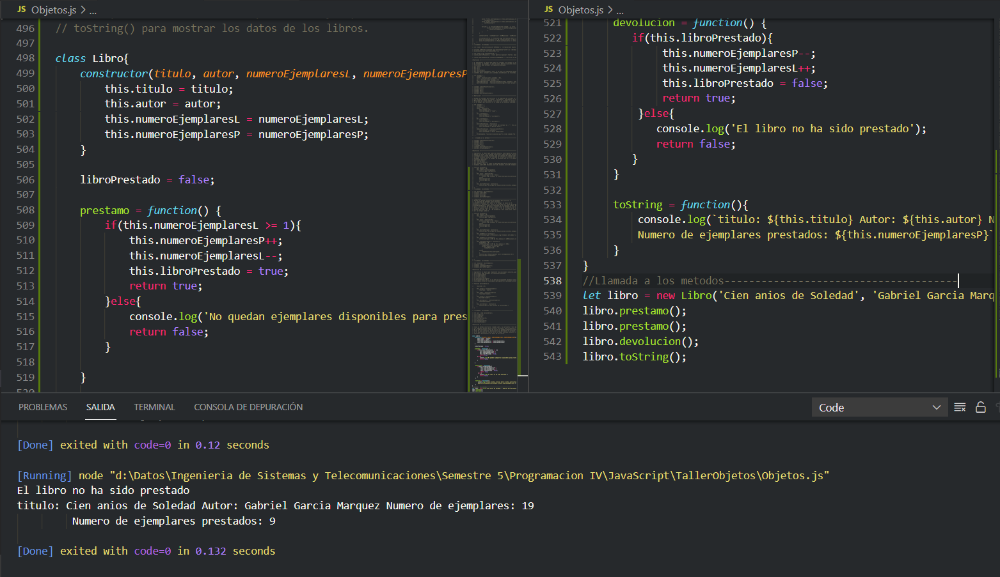

## Ejercicio #12
Se está pensando en el diseño de un juego que incluye la nave espacial Enterprise. En el juego, esta nave tiene un nivel de potencia de 0 a 100, 
y un nivel de coraza de 0 a 20. La Enterprise puede encontrarse con una pila atómica, en cuyo caso su potencia aumenta en 25. encontrarse con 
un escudo, en cuyo caso su nivel de coraza aumenta en 10. recibir un ataque, en este caso se especi�can los puntos de fuerza del ataque recibido. 
La Enterprise �para� el ataque con la coraza, y si la coraza no alcanza, el resto se descuenta de la potencia. P.ej. si la Enterprise con 80 
de potencia y 12 de coraza recibe un ataque de 20 puntos de fuerza, puede parar solamente 12 con la coraza, los otros 8 se descuentan de la 
potencia. La nave debe quedar con 72 de potencia y 0 de coraza. Si la Enterprise no tiene nada de coraza al momento de recibir el ataque, 
entonces todos los puntos de fuerza del ataque se descuentan de la potencia...... La potencia y la coraza tienen que mantenerse en los rangos 
indicados, p.ej. si la Enterprise tien 16 puntos de coraza y se encuentra con un escudo, entonces queda en 20 puntos de coraza, no en 
26. Tampoco puede quedar negativa la potencia, a lo sumo queda en 0. La Enterprise nace con 50 de potencia y 5 de coraza.
  Implementar este metodo constructor de la Enterprise, que tiene que entender los siguientes mensajes:
12.1 potencia() 
12.2 coraza() 
12.3 encontrarPilaAtomica() 
12.4 encontrarEscudo() 
12.5 recibirAtaque(puntos)
 P.ej. sobre un REPL recién lanzado, después de esta secuencia enterprise.encontrarPilaAtomica() enterprise.recibirAtaque(14) 
enterprise.encontrarEscudo() la potencia de la Enterprise debe ser 66, y su coraza debe ser 10


```javascript
function Enterprise(){

    potencia = 50;
    coraza = 5;
    impacto =0;

    this.limitesPotencia = function(){
        if(potencia > 100){potencia = 100;}
        if(potencia < 0){potencia = 0;}
    }

    this.limitesCoraza = function(){
        if(coraza > 20){coraza = 20;}
        if(coraza < 0){coraza = 0;}
    }

    this.potencia = function(){
        console.log('La potencia de la Enterprose es ' + potencia);
    }

    this.coraza = function(){
        console.log(`La coraza de la Enterprise es de ${coraza}`)
    }

    this.encontrarPilaAtomica = function(){
        potencia+=25;
        this.limitesPotencia();
    }

    this.encontrarEscudo = function(){
        coraza+=10;
        this.limitesCoraza();        
    }

    this.recibirAtaque = function(puntos){
        impacto = puntos - coraza;
        if(impacto > 0){
            coraza = 0;
            potencia-=impacto;
        }else{coraza-=puntos;}
        this.limitesCoraza();
        this.limitesPotencia();
    }

}

let enterprise = new Enterprise();
enterprise.encontrarPilaAtomica();
enterprise.recibirAtaque(14); 
enterprise.encontrarEscudo();
enterprise.potencia();
enterprise.coraza();


```
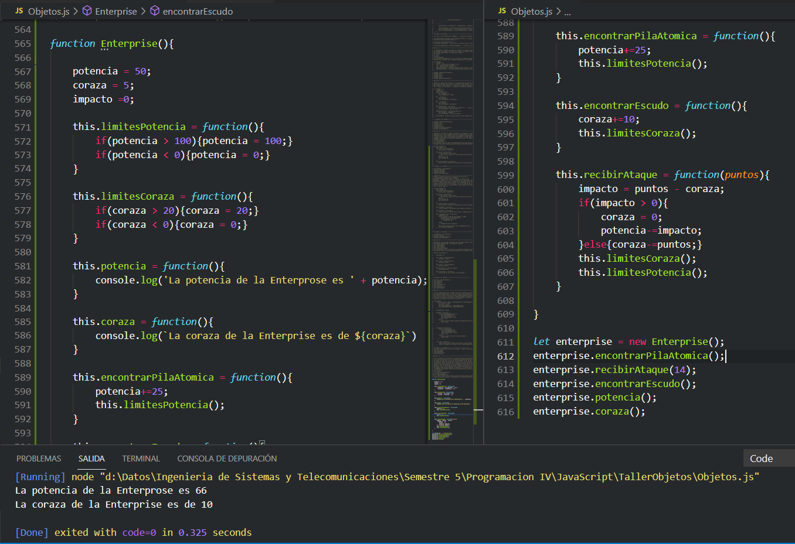

## Ejercicio #13
Agregar al metodo constructor de la Enterprise del ejercicio 12, la capacidad de entender estos mensajes. 
fortalezaDefensiva(), que es el máximo nivel de ataque que puede resistir, o sea, coraza más potencia. 
necesitaFortalecerse(), tiene que ser true si su coraza es 0 y su potencia es menos de 20. 
fortalezaOfensiva(), que corresponde a cuántos puntos de fuerza tendría un ataque de la Enterprise. 
Se calcula así: si tiene menos de 20 puntos de potencia entonces es 0, si no es (puntos de potencia - 20) / 2.


```javascript
 function Enterprise(){

    potencia = 50;
    coraza = 5;
    impacto =0;
    fortalezaD = 0;
    fortalezaO = 0;

    this.limitesPotencia = function(){
        if(potencia > 100){potencia = 100;}
        if(potencia < 0){potencia = 0;}
    }

    this.limitesCoraza = function(){
        if(coraza > 20){coraza = 20;}
        if(coraza < 0){coraza = 0;}
    }

    this.potencia = function(){
        console.log('La potencia de la Enterprose es ' + potencia);
    }

    this.coraza = function(){
        console.log(`La coraza de la Enterprise es de ${coraza}`)
    }

    this.encontrarPilaAtomica = function(){
        potencia+=25;
        this.limitesPotencia();
    }

    this.encontrarEscudo = function(){
        coraza+=10;
        this.limitesCoraza();        
    }

    this.recibirAtaque = function(puntos){
        impacto = puntos - coraza;
        if(impacto > 0){
            coraza = 0;
            potencia-=impacto;
        }else{coraza-=puntos;}
        this.limitesCoraza();
        this.limitesPotencia();
    }

    this.fortalezaDefensiva = function(){fortalezaD = potencia + coraza;}
    this.necesitaFortalecerse = function(){
        if(coraza == 0 && potencia < 20){ 
            console.log('Necesita fortalecerse, esta muy debil');
            return true;
        }
    }

    this.fortalezaOfensiva = function(){
        if(potencia < 20){fortalezaO = 0;}
        else{ fortalezaO = (potencia - 20) / 2;}
    }

    this.mostrarFortalezas = function(){
        console.log(`La fortaleza defensiva de la enterprise es de ${fortalezaD} -------
        la fortalezaOfensiva de la Enterprise es de ${fortalezaO}`);
    }

}

let enterprise = new Enterprise();
enterprise.encontrarPilaAtomica();
enterprise.recibirAtaque(14); 
enterprise.encontrarEscudo();
enterprise.potencia();
enterprise.coraza();
enterprise.fortalezaDefensiva();
enterprise.fortalezaOfensiva();
enterprise.mostrarFortalezas();


```
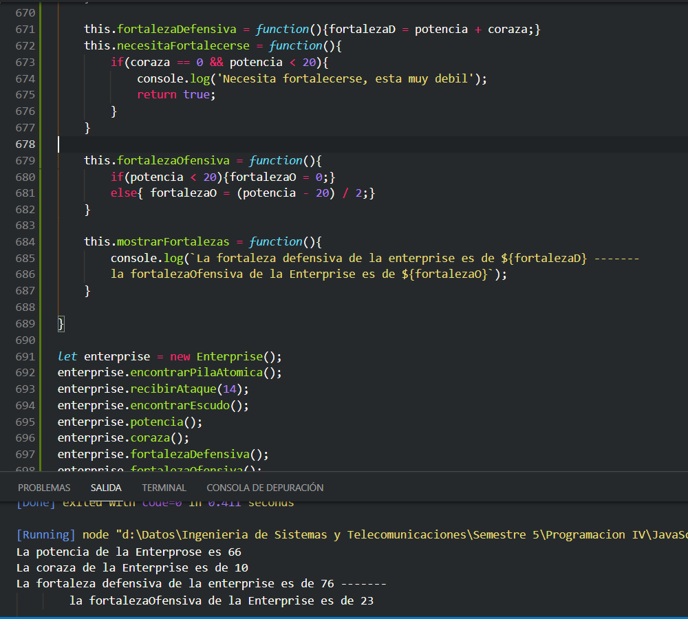

## Ejercicio #14
Un taller de diseño de autos quiere estudiar un nuevo prototipo. Para eso, nos piden hacer un metodo constructor concentrado en las 
 características del motor. El prototipo de motor tiene 5 cambios (de primera a quinta), y soporta hasta 5000 RPM. 
La velocidad del auto se calcula así: (rpm / 100) * (0.5 + (cambio / 2)). P.ej. en tercera a 2000 rpm, la velocidad es 20 * (0.5 + 1.5) = 40.
También nos interesa controlar el consumo. Se parte de una base de 0.05 litros por kilómetro. 
A este valor se le aplican los siguientes ajustes: Si el motor está a más de 3000 rpm, entonces se multiplica por (rpm - 2500) / 500. 
P.ej., a 3500 rpm hay que multiplicar por 2, a 4000 rpm por 3, etc. Si el motor está en primera, entonces se multiplica por 3. 
Si el motor está en segunda, entonces se multiplica por 2. Los efectos por revoluciones y por cambio se acumulan. P.ej.
si el motor está en primera y a 5000 rpm, entonces el consumo es 0.05 * 5 * 3 = 0.75 litros/km. El metodo constructor debe entender 
 estos mensajes: arrancar(), se pone en primera con 500 rpm. subirCambio() bajarCambio() subirRPM(cuantos) bajarRPM(cuantos) velocidad() 
consumoActualPorKm()

```javascript
function Motor(){

    cambio = 0;
    rpm = 0;
    velocidad = 0;
    consumoBase = 0.05;
    consumo = 0;

    this.arrancar = function(){
        cambio = 1;
        rpm = 500;
    }

    this.subirCambio = function(){
        cambio++;
    }

    this.bajarCambio = function(){
        cambio--;
    }

    this.subirRPM = function(cuantos){
        rpm+=cuantos;
    }

    this.bajarRPM = function(cuantos){
        rpm-=cuantos;
    }

    this.velocidad = function(){
        velocidad = (rpm / 100) * (0.5 + (cambio / 2));
        console.log('La velocida es de: '+ velocidad);
    }

    this.consumoActualKM = function(){
        if(rpm > 3000 && cambio == 1 ){
            consumo = consumoBase*((rpm - 2500) / 500) * 3;
            return;
        }else if(rpm > 3000 && cambio == 2 ){
            consumo = consumoBase*((rpm - 2500) / 500) * 2;
            return;
        }else if(rpm > 3000 ){
            consumo = consumoBase*((rpm - 2500) / 500);
        }
        else if(cambio == 1 ){
            consumo = consumoBase * 3;
        }
        else if(cambio == 2){
            consumo = consumoBase * 2;
        }
    }

    this.mostrarConsumo = function(){
        console.log(`El consumo actual es de ${consumo}`);
    }
}

//llamada a los metodos------------------------------------------------------
let motor = new Motor();
motor.arrancar();
motor.subirCambio();
motor.subirRPM(4500);
motor.velocidad();
motor.consumoActualKM();
motor.mostrarConsumo();


```
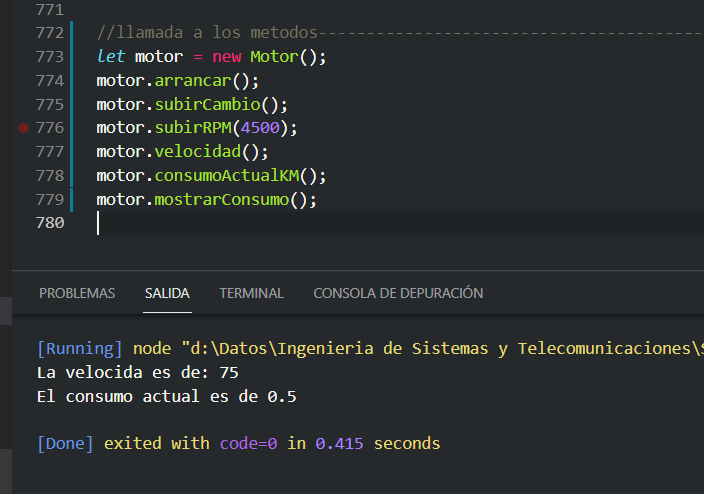

